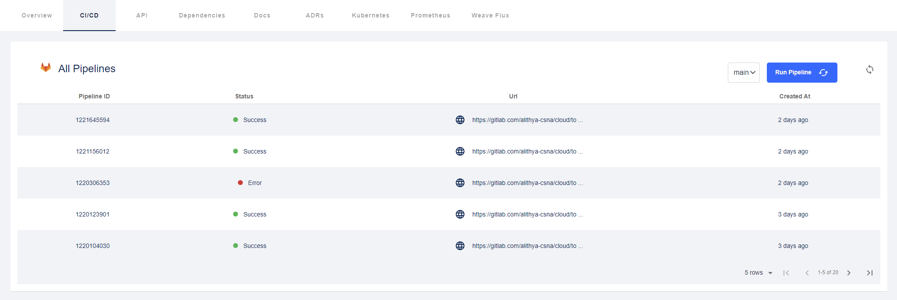

En supplément de l'onglet standard CI/CD, le plugin Gitlab Pipelines affiche une carte dans la page d'accueille des composants permettant de lancer unitairement des traitement d'intégration Gitlab CI.


{ align=center width="800" }
{ align=center width="800" }

## Mode opératoire

Pour activer l'onglet CI/CD, ajouter l'annotation `gitlab.com/project-slug` pointant vers le chemin d'accès du dépôt de code dans Gitlab.

```diff
metadata:
  title: Backstage
  name: backstage
  namespace: platform-engineering
  annotations:
+   gitlab.com/project-slug: alithya-csna/cloud/toolbox/backstage-app
```
Pour active la carte, ajouter l'annotation `gitlab.com/jobs` mentionnant la liste des traitements Gitlab que l'on souhaites lanccer individuellement.

```diff
metadata:
  title: Backstage
  name: backstage
  namespace: platform-engineering
  annotations:
+   gitlab.com/jobs: >-
+     PostgreSQL Vector:build-oci-pgvector',
+     Techdocs:build-oci-techdocs,
+     All-In-One:build-oci-all-in-one
```

Une fois les annotations publiées dans la branche `main`, la carte s'affichera instantanément.

## Références

* [Plugin Gilab Pipelines](https://platform.vee.codes/plugin/Gitlab%20Pipelines/)
* [End of Life](https://endoflife.date)