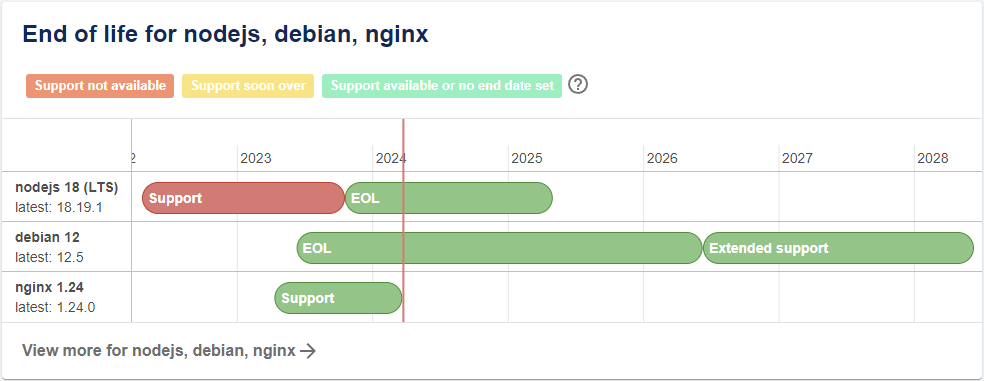

Le plugin End of Life affiche une carte dans la page d'acceuille des composants qui fournie des données de fin de vie relatives au socle techologique employé dans le code source.

{ align=center width="800" }

## Mode opératoire

Ajouter l'annotation `endoflife.date/products` mentionnant le socle technologique des composants de type `service` et `website` à l'aide du référentiel [endoflife.date](https://endoflife.date).

```diff
metadata:
  title: Backstage SPA
  name: backstage-app
  namespace: platform-engineering
  annotations:
+   endoflife.date/products: debian@11,node@18,nginx@1.24,react@17
```

Une fois l'annotation publiée dans la branche `main`, la carte s'affichera instantanément.

## Références

* [Plugin Linguist](https://github.com/dweber019/backstage-plugins/tree/main/plugins/endoflife)
* [End of Life](https://endoflife.date)