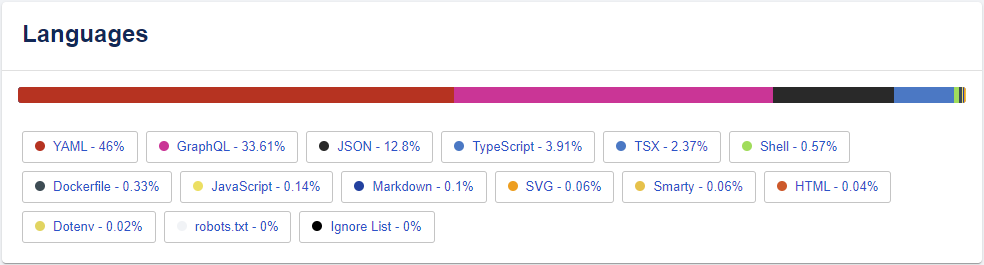

Le plugin Linguist affiche une carte dans la page d'accueil des composants qui fournie une répartition des languages de programmation utilisés dans la locatlisation du code source (c.-à-.d dépôt Github, Gitlab, Azure DevOps, etc.).

{ align=center width="800" }

## Mode opératoire

Ajouter l'annotation `backstage.io/linguist` pointant vers l'URL de dépôt du code source des composant de type `service` et `website`.

```diff
metadata:
  title: Backstage
  name: backstage
  namespace: platform-engineering
  annotations:
+   backstage.io/linguist: https://gitlab.com/alithya-csna/cloud/toolbox/backstage-app
```

Une fois l'annotation publiée dans la branche `main`, le portail analyse le dépôt pour réstituer la carte.

## Références

* [Plugin Linguist](https://github.com/backstage/backstage/blob/master/plugins/linguist)