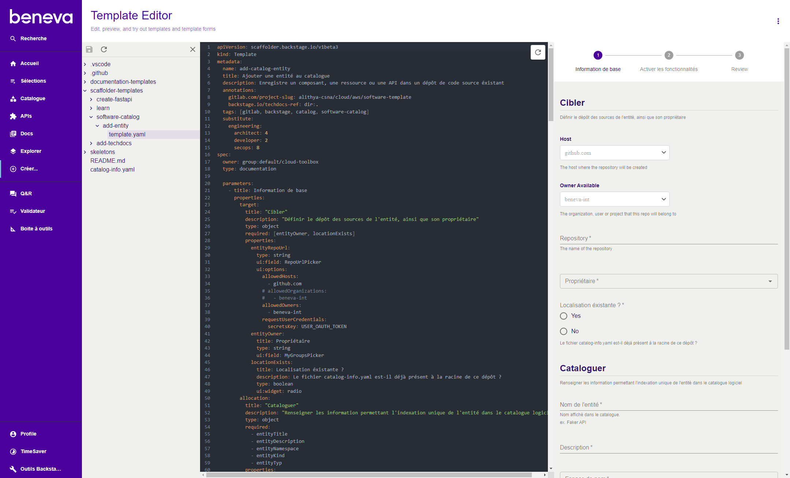

Le portail embarque un éditeur en ligne permettant de visualiser instantanément l'agencement de la page du formulaire associé au gabarit en cours de développement sur le poste local.

S'authentifier auprès du [portail de l'environnement de DEV](https://backstage.dev.alithya-mws.com).

Dans la barre latérale gauche, cliquer sur **Créer...**, cliquer sur le bouton de menu :material-dots-vertical: puis selectionner **Template Editor**.

Sélectionner le répertoire local du dépôt de gabarits.

> **Attention**: Lorsque l'on clique sur le bouton **Sauvegarder :material-content-save:**, les modifications sont reversée dans le fichier local.

Cliquer sur la tuile **Load Template Directoy**

