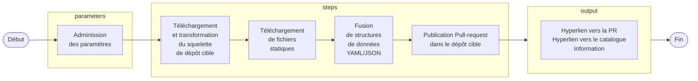

La séquence `parameters.steps` déclare les étapes _(actions)_ d'intégration, de transformation et de publication des fichiers dans le dépôt cible. Ces actions sont exécutés dans l'ordre dans lequel elle sont rédigées au sein du fichier `template.yaml`.

L'exemple ci-dessous démontre le pipeline de livraison décrit ci-dessus, ainsi la mise oeuvre d'étapes:

- De champs optionnels sous le contrôle de l'utilisateur.
- De 

!!! tip "Conseils"

    La liste des actions supportées est disponible sein même du portail ([/create/actions](https://backstage.dev.alithya-mws.com/create/actions)).
    
    Afin d'acclérrer et uniformiser le développement des gabarits, l'équipe Expérience développeur maintient églement divers [extraits codes](../02-quick-reference.md) prêts à l'emploi.

